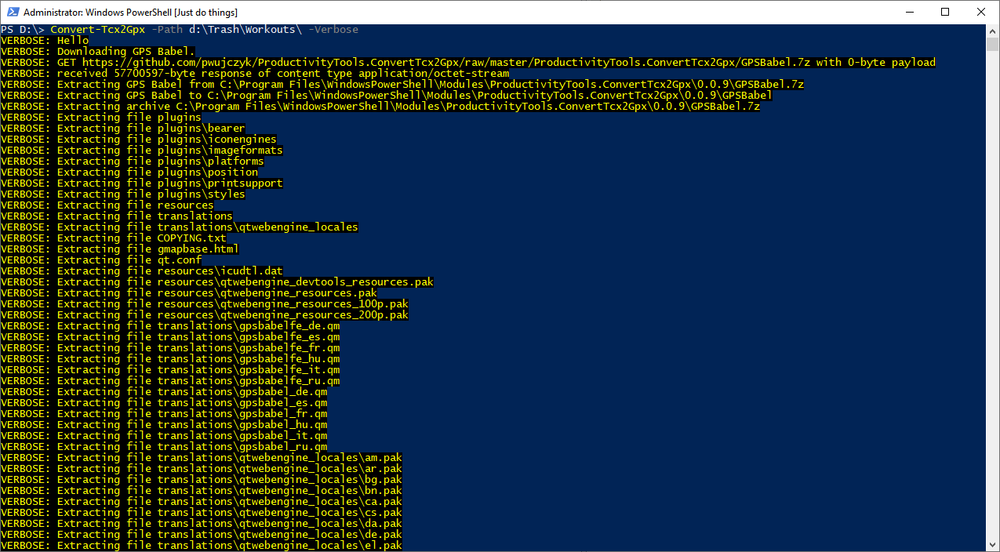
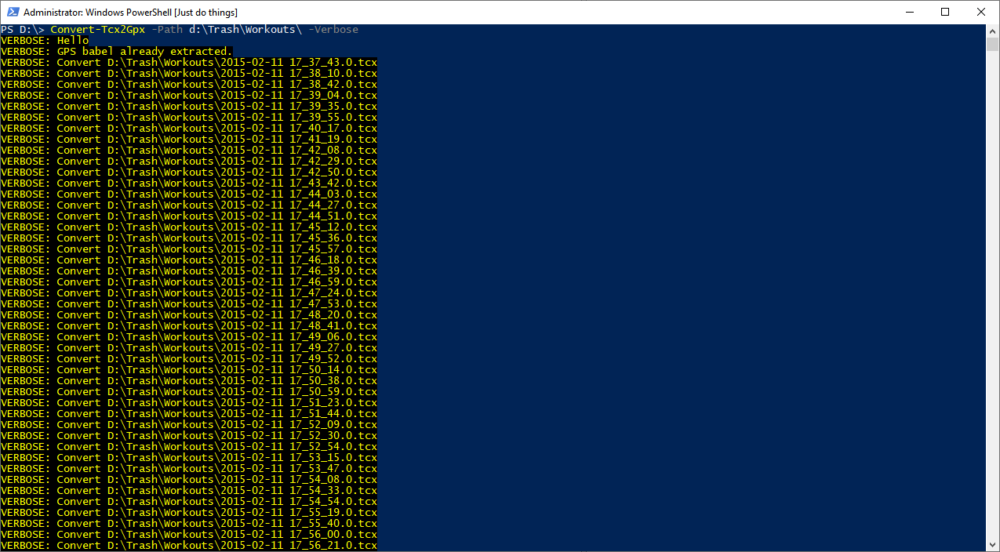

<!--Category:Powershell--> 
 <p align="right">
    <a href="https://www.powershellgallery.com/packages/ProductivityTools.ConvertTcx2Gpx/"></a>
    <a href="http://productivitytools.tech/import-modulesfromdirectory/"><a> 
    <a href="https://github.com/pwujczyk/ProductivityTools.ConvertTcx2Gpx"></a>
</p>
<p align="center">
    <a href="http://productivitytools.tech/">
        
    </a>
</p>


# Convert TCX to GPX

Module performs bulk conversion from TCX files to GPX files. 
<!--more-->
Module was created to help move sport activities from Endomondo to another portal. It takes directory with TCX files and convert every file to GPX. 


```powershell
Convert-Tcx2Gpx -Path d:\Trash\Workouts\ -Verbose
```

Module first will download **GPSBabel** application which is used to perform conversion. application is stored directly in the GitHub.
<!--og-image-->


Next it will extract it and start the conversion.

